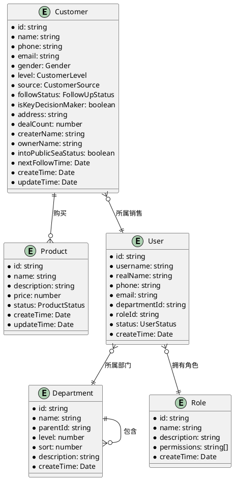

# CRM 客户关系管理系统 - 数据模型使用手册

## 📚 手册概述

本手册详细描述了 CRM 系统中所有数据模型的结构、字段说明、使用方法和最佳实践，帮助开发人员正确理解和使用数据模型。

## 👥 客户实体模型详解

### Customer 客户模型

```typescript
interface Customer {
  id: string // 客户唯一标识
  name: string // 客户姓名
  phone: string // 手机号码
  email: string // 电子邮箱
  gender: Gender // 性别枚举
  level: CustomerLevel // 客户级别
  source: CustomerSource // 客户来源
  followStatus: FollowUpStatus // 跟进状态
  isKeyDecisionMaker: IsKeyDecisionMaker // 是否关键决策人
  address: string // 客户地址
  dealCount: number // 成交次数
  createrName: string // 创建人姓名
  ownerName: string // 所属销售姓名
  intoPublicSeaStatus: IntoPublicSeaStatus // 公海转入状态
  nextFollowTime: Date // 下次跟进时间
  createTime: Date // 创建时间
  updateTime: Date // 更新时间
}
```

#### 字段详细说明

| 字段名                | 类型                  | 必填 | 说明               | 验证规则             | 默认值   |
| --------------------- | --------------------- | ---- | ------------------ | -------------------- | -------- |
| `id`                  | `string`              | 是   | 系统生成的唯一标识 | UUID 格式            | 自动生成 |
| `name`                | `string`              | 是   | 客户姓名或公司名   | 1-50 个字符          | -        |
| `phone`               | `string`              | 是   | 手机联系方式       | 11 位手机号格式      | -        |
| `email`               | `string`              | 是   | 邮箱地址           | 邮箱格式验证         | -        |
| `gender`              | `Gender`              | 否   | 客户性别           | 0=男,1=女,2=保密     | `2`      |
| `level`               | `CustomerLevel`       | 是   | 客户价值级别       | 0=普通,1=优质,2=重点 | `0`      |
| `source`              | `CustomerSource`      | 是   | 客户获取渠道       | 见枚举定义           | -        |
| `followStatus`        | `FollowUpStatus`      | 否   | 当前跟进状态       | 见枚举定义           | `0`      |
| `isKeyDecisionMaker`  | `IsKeyDecisionMaker`  | 否   | 是否决策人         | 0=是,1=否            | `1`      |
| `address`             | `string`              | 否   | 客户联系地址       | 最大 100 字符        | -        |
| `dealCount`           | `number`              | 否   | 历史成交次数       | 非负整数             | `0`      |
| `createrName`         | `string`              | 是   | 创建客户的人员     | 系统自动填充         | -        |
| `ownerName`           | `string`              | 否   | 当前负责人         | 可为空表示公海       | -        |
| `intoPublicSeaStatus` | `IntoPublicSeaStatus` | 否   | 公海状态标识       | 0=私海,1=公海        | `0`      |
| `nextFollowTime`      | `Date`                | 否   | 计划下次跟进时间   | 日期格式             | -        |
| `createTime`          | `Date`                | 是   | 记录创建时间       | 系统自动生成         | 当前时间 |
| `updateTime`          | `Date`                | 是   | 记录更新时间       | 系统自动更新         | 当前时间 |

#### 客户模型使用示例

```typescript
// 创建新客户
const newCustomer: Customer = {
  name: '张三',
  phone: '13800138000',
  email: 'zhangsan@example.com',
  gender: Gender.MALE,
  level: CustomerLevel.ORDINARY_CUSTOMER,
  source: CustomerSource.OFFICIAL_WEBSITE,
  followStatus: FollowUpStatus.NEW_CUSTOMER,
  isKeyDecisionMaker: IsKeyDecisionMaker.YES,
  address: '北京市朝阳区xxx街道',
  dealCount: 0,
  createrName: '销售小王',
  ownerName: '销售小王',
  intoPublicSeaStatus: IntoPublicSeaStatus.NOT_INTO_PUBLIC_SEA,
  nextFollowTime: new Date(Date.now() + 3 * 24 * 60 * 60 * 1000), // 3天后
  createTime: new Date(),
  updateTime: new Date()
}

// 更新客户信息
const updateCustomer: Partial<Customer> = {
  id: 'customer-uuid-123',
  followStatus: FollowUpStatus.INTERESTED,
  nextFollowTime: new Date(Date.now() + 7 * 24 * 60 * 60 * 1000), // 7天后
  updateTime: new Date()
}
```

## 📦 产品实体模型详解

### Product 产品模型

```typescript
interface Product {
  id: string // 产品唯一标识
  name: string // 产品名称
  description: string // 产品描述
  price: number // 产品价格
  status: ProductStatus // 产品状态
  createTime: Date // 创建时间
  updateTime: Date // 更新时间
}
```

#### 字段详细说明

| 字段名        | 类型            | 必填 | 说明         | 验证规则               | 默认值   |
| ------------- | --------------- | ---- | ------------ | ---------------------- | -------- |
| `id`          | `string`        | 是   | 产品唯一标识 | UUID 格式              | 自动生成 |
| `name`        | `string`        | 是   | 产品名称     | 1-100 个字符           | -        |
| `description` | `string`        | 否   | 产品详细描述 | 最大 500 字符          | -        |
| `price`       | `number`        | 是   | 产品售价     | 正数，最多 2 位小数    | `0.00`   |
| `status`      | `ProductStatus` | 是   | 产品销售状态 | 0=初始化,1=上架,2=下架 | `0`      |
| `createTime`  | `Date`          | 是   | 创建时间     | 系统自动生成           | 当前时间 |
| `updateTime`  | `Date`          | 是   | 更新时间     | 系统自动更新           | 当前时间 |

#### 产品模型使用示例

```typescript
// 创建新产品
const newProduct: Product = {
  name: 'CRM企业版',
  description: '适用于中大型企业的客户关系管理系统',
  price: 999.99,
  status: ProductStatus.INITIALIZING,
  createTime: new Date(),
  updateTime: new Date()
}

// 产品上架操作
const publishProduct: Partial<Product> = {
  id: 'product-uuid-456',
  status: ProductStatus.ONLINE,
  updateTime: new Date()
}
```

## 🏢 系统配置模型详解

### Department 部门模型

```typescript
interface Department {
  id: string // 部门唯一标识
  name: string // 部门名称
  parentId: string // 上级部门ID
  level: number // 部门层级
  sort: number // 排序序号
  description: string // 部门描述
  createTime: Date // 创建时间
}
```

#### 部门模型使用示例

```typescript
// 创建根部门
const rootDepartment: Department = {
  name: '总公司',
  parentId: '0', // 0表示根部门
  level: 1,
  sort: 1,
  description: '公司总部',
  createTime: new Date()
}

// 创建子部门
const subDepartment: Department = {
  name: '销售部',
  parentId: rootDepartment.id,
  level: 2,
  sort: 1,
  description: '负责产品销售和客户管理',
  createTime: new Date()
}
```

### User 用户模型

```typescript
interface User {
  id: string // 用户唯一标识
  username: string // 用户名（登录账号）
  realName: string // 真实姓名
  phone: string // 手机号码
  email: string // 电子邮箱
  departmentId: string // 所属部门ID
  roleId: string // 角色ID
  status: UserStatus // 用户状态
  createTime: Date // 创建时间
}
```

#### 用户模型使用示例

```typescript
// 创建新用户
const newUser: User = {
  username: 'sales001',
  realName: '销售小王',
  phone: '13900139000',
  email: 'sales001@company.com',
  departmentId: 'dept-sales-id',
  roleId: 'role-sales-id',
  status: UserStatus.ACTIVE,
  createTime: new Date()
}
```

### Role 角色模型

```typescript
interface Role {
  id: string // 角色唯一标识
  name: string // 角色名称
  description: string // 角色描述
  permissions: string[] // 权限标识列表
  createTime: Date // 创建时间
}
```

#### 角色模型使用示例

```typescript
// 销售角色配置
const salesRole: Role = {
  name: '销售人员',
  description: '负责客户管理和产品销售',
  permissions: ['sys:customer:add', 'sys:customer:edit', 'sys:customer:remove', 'sys:customer:export', 'sys:product:view'],
  createTime: new Date()
}
```

## 🔗 实体关系说明

### 实体关系图



### 关系说明

#### 客户-用户关系

- **一对多关系**: 一个销售可以管理多个客户
- **所有权转移**: 客户可以在不同销售之间转移
- **公海机制**: 无归属的客户属于公海，可以被任何销售认领

#### 客户-产品关系

- **多对多关系**: 客户可以购买多个产品
- **购买历史**: `dealCount`字段记录客户成交次数
- **产品推荐**: 基于客户历史购买数据推荐相关产品

#### 用户-部门关系

- **层级结构**: 支持多级部门树状结构
- **数据权限**: 基于部门实现数据隔离
- **管理范围**: 上级部门可以查看下级部门数据

#### 用户-角色关系

- **权限控制**: 通过角色实现细粒度权限管理
- **多角色支持**: 用户可以拥有多个角色
- **动态权限**: 权限可以实时更新和生效

## 🛠️ 数据模型操作指南

### 客户模型操作

#### 查询客户列表

```typescript
// 分页查询客户
const queryCustomers = async (params: CustomerQueryParams) => {
  const response = await CustomerApi.page({
    pageNum: params.pageNum || 1,
    pageSize: params.pageSize || 10,
    name: params.name, // 可选：客户名称模糊查询
    phone: params.phone, // 可选：手机号精确查询
    level: params.level, // 可选：客户级别筛选
    source: params.source, // 可选：客户来源筛选
    followStatus: params.followStatus, // 可选：跟进状态筛选
    isPublic: params.isPublic // 必选：0=私海，1=公海
  })
  return response.data
}
```

#### 创建客户

```typescript
const createCustomer = async (customerData: CreateCustomerDto) => {
  // 数据验证
  if (!customerData.name || !customerData.phone || !customerData.email) {
    throw new Error('客户名称、手机号和邮箱为必填项')
  }

  // 手机号格式验证
  if (!/^1[3-9]\d{9}$/.test(customerData.phone)) {
    throw new Error('手机号格式不正确')
  }

  // 邮箱格式验证
  if (!/^[A-Za-z0-9._%+-]+@[A-Za-z0-9.-]+\.[A-Za-z]{2,}$/.test(customerData.email)) {
    throw new Error('邮箱格式不正确')
  }

  const response = await CustomerApi.saveOrEdit(customerData)
  return response.data
}
```

#### 转入公海

```typescript
const moveToPublicSea = async (customerId: string) => {
  const response = await CustomerApi.toPublic({
    id: customerId
  })

  // 更新本地状态
  customerStore.updateCustomerStatus(customerId, {
    intoPublicSeaStatus: IntoPublicSeaStatus.INTO_PUBLIC_SEA,
    ownerName: null, // 清空负责人
    updateTime: new Date()
  })

  return response.data
}
```

### 产品模型操作

#### 产品状态管理

```typescript
const manageProductStatus = async (productId: string, action: 'publish' | 'offline') => {
  const updateData: Partial<Product> = {
    id: productId,
    updateTime: new Date()
  }

  switch (action) {
    case 'publish':
      updateData.status = ProductStatus.ONLINE
      break
    case 'offline':
      updateData.status = ProductStatus.OFFLINE
      break
  }

  const response = await ProductApi.saveOrEdit(updateData)
  return response.data
}
```

## 📊 数据验证规则

### 前端验证规则

```typescript
// 客户表单验证规则
const customerFormRules = {
  name: [
    { required: true, message: '请输入客户名称', trigger: 'blur' },
    { min: 1, max: 50, message: '客户名称长度在1到50个字符', trigger: 'blur' }
  ],
  phone: [
    { required: true, message: '请输入客户手机号', trigger: 'blur' },
    { pattern: /^1[3-9]\d{9}$/, message: '手机号格式不正确', trigger: 'blur' }
  ],
  email: [
    { required: true, message: '请输入邮箱地址', trigger: 'blur' },
    {
      pattern: /^[A-Za-z0-9._%+-]+@[A-Za-z0-9.-]+\.[A-Za-z]{2,}$/,
      message: '邮箱格式不正确',
      trigger: 'blur'
    }
  ],
  level: [{ required: true, message: '客户级别不能为空', trigger: 'change' }],
  source: [{ required: true, message: '客户来源不能为空', trigger: 'change' }]
}

// 产品表单验证规则
const productFormRules = {
  name: [
    { required: true, message: '请输入产品名称', trigger: 'blur' },
    { min: 1, max: 100, message: '产品名称长度在1到100个字符', trigger: 'blur' }
  ],
  price: [
    { required: true, message: '请输入产品价格', trigger: 'blur' },
    {
      pattern: /^(0|[1-9]\d*)(\.\d{1,2})?$/,
      message: '价格格式不正确，最多保留两位小数',
      trigger: 'blur'
    }
  ]
}
```

### 后端验证建议

```typescript
// 客户数据验证DTO
export class CreateCustomerDto {
  @IsString()
  @IsNotEmpty({ message: '客户名称不能为空' })
  @Length(1, 50, { message: '客户名称长度必须在1-50个字符之间' })
  name: string

  @IsString()
  @IsNotEmpty({ message: '手机号不能为空' })
  @Matches(/^1[3-9]\d{9}$/, { message: '手机号格式不正确' })
  phone: string

  @IsString()
  @IsNotEmpty({ message: '邮箱不能为空' })
  @IsEmail({}, { message: '邮箱格式不正确' })
  email: string

  @IsEnum(Gender)
  gender: Gender

  @IsEnum(CustomerLevel)
  @IsNotEmpty({ message: '客户级别不能为空' })
  level: CustomerLevel

  @IsEnum(CustomerSource)
  @IsNotEmpty({ message: '客户来源不能为空' })
  source: CustomerSource

  @IsOptional()
  @IsString()
  @MaxLength(100, { message: '地址长度不能超过100个字符' })
  address?: string
}
```

## 🔄 数据状态管理

### Pinia Store 设计

```typescript
// 客户状态管理
export const useCustomerStore = defineStore('customer', {
  state: () => ({
    customers: [] as Customer[],
    currentCustomer: null as Customer | null,
    loading: false,
    total: 0
  }),

  getters: {
    // 获取私海客户
    privateCustomers: (state) => state.customers.filter((c) => c.intoPublicSeaStatus === IntoPublicSeaStatus.NOT_INTO_PUBLIC_SEA),

    // 获取公海客户
    publicCustomers: (state) => state.customers.filter((c) => c.intoPublicSeaStatus === IntoPublicSeaStatus.INTO_PUBLIC_SEA),

    // 按级别统计客户
    customerLevelStats: (state) => {
      const stats = {}
      state.customers.forEach((customer) => {
        const level = CustomerLevelList[customer.level].label
        stats[level] = (stats[level] || 0) + 1
      })
      return stats
    }
  },

  actions: {
    async fetchCustomers(params: any) {
      this.loading = true
      try {
        const response = await CustomerApi.page(params)
        this.customers = response.data.list
        this.total = response.data.total
      } finally {
        this.loading = false
      }
    },

    async createCustomer(customer: CreateCustomerDto) {
      const response = await CustomerApi.saveOrEdit(customer)
      this.customers.push(response.data)
      return response.data
    },

    async updateCustomer(customer: Partial<Customer>) {
      const response = await CustomerApi.saveOrEdit(customer)
      const index = this.customers.findIndex((c) => c.id === customer.id)
      if (index !== -1) {
        this.customers[index] = { ...this.customers[index], ...response.data }
      }
      return response.data
    }
  }
})
```

## 📈 性能优化建议

### 数据加载优化

1. **分页加载**: 使用分页机制避免一次性加载大量数据
2. **懒加载**: 大表格使用虚拟滚动和懒加载
3. **缓存策略**: 对频繁访问的数据实现客户端缓存
4. **预加载**: 预加载用户可能访问的数据

### 数据更新优化

1. **增量更新**: 只更新变化的数据字段
2. **批量操作**: 支持批量数据操作减少网络请求
3. **乐观更新**: 先更新 UI，失败时回滚
4. **防抖处理**: 避免频繁的数据更新请求

## 🛡️ 数据安全建议

### 敏感数据保护

1. **数据脱敏**: 敏感字段在列表中部分隐藏
2. **传输加密**: 使用 HTTPS 协议传输数据
3. **访问控制**: 基于角色的数据访问控制
4. **操作日志**: 记录所有数据变更操作

### 数据备份策略

1. **定期备份**: 定期备份重要客户数据
2. **版本控制**: 保留数据变更历史记录
3. **灾难恢复**: 制定数据恢复应急预案
4. **数据审计**: 定期进行数据完整性检查

---

_数据模型手册版本: v1.0.0_ _最后更新: 2025-10-26_ _维护团队: CRM 开发组_
