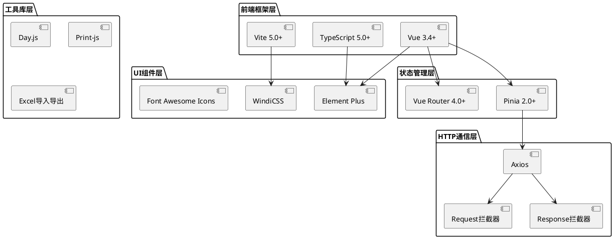
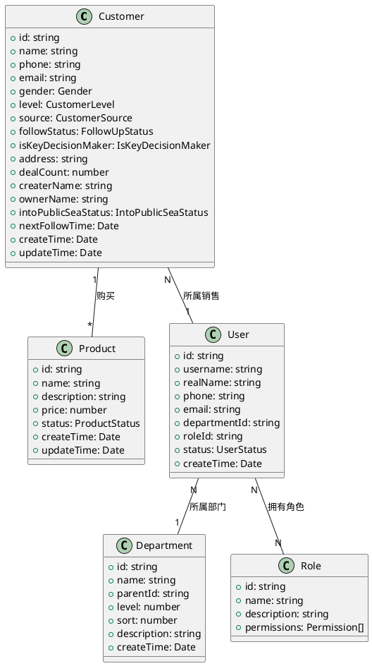
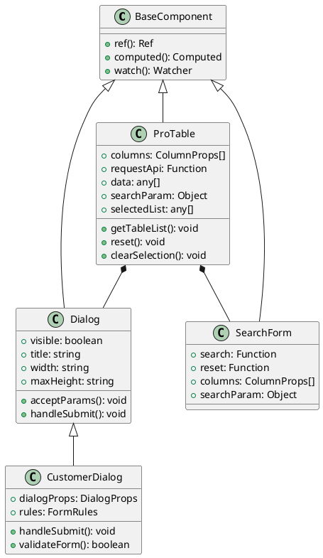
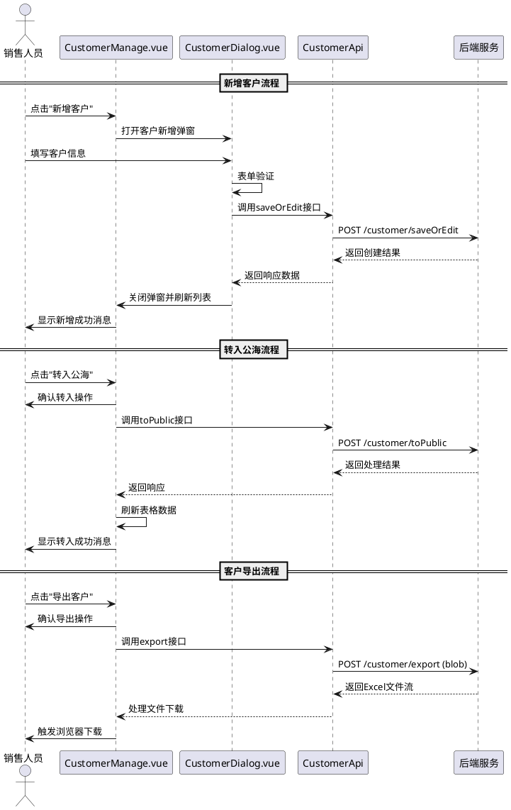
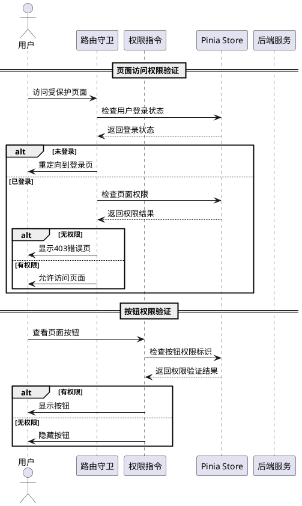
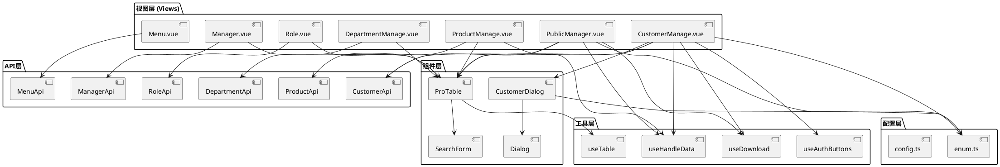

# CRM 客户关系管理系统 - 架构分析文档

## 📋 文档概述

本文档详细描述了 CRM 客户关系管理系统的技术架构、核心组件、数据模型和业务逻辑，为开发团队提供全面的技术参考。

## 🏗️ 技术架构全景图

### 系统架构层次

```plantuml
@startuml
!define AWSPUML https://raw.githubusercontent.com/awslabs/aws-icons-for-plantuml/v17.0/dist
!include AWSPUML/AWSCommon.puml
!include AWSPUML/ApplicationIntegration/APIGateway.puml
!include AWSPUML/Compute/Lambda.puml
!include AWSPUML/Database/DynamoDB.puml

package "前端层 (Vue 3 + TypeScript)" {
    [客户管理模块] as CustomerUI
    [产品管理模块] as ProductUI
    [系统管理模块] as SystemUI
    [公海客户模块] as PublicUI
}

package "组件层" {
    [ProTable组件] as ProTable
    [Dialog组件] as Dialog
    [SearchForm组件] as SearchForm
    [Upload组件] as Upload
}

package "API服务层" {
    [客户API] as CustomerAPI
    [产品API] as ProductAPI
    [系统API] as SystemAPI
}

package "数据状态管理" {
    [Pinia Store] as Store
    [用户状态] as UserState
    [权限状态] as PermissionState
}

package "工具与配置" {
    [HTTP拦截器] as HttpInterceptor
    [权限指令] as PermissionDirective
    [枚举配置] as EnumConfig
    [路由守卫] as RouteGuard
}

CustomerUI --> ProTable
ProductUI --> ProTable
SystemUI --> ProTable
PublicUI --> ProTable

CustomerUI --> CustomerAPI
ProductUI --> ProductAPI
SystemUI --> SystemAPI

CustomerUI --> Dialog
CustomerUI --> SearchForm

ProTable --> Store
CustomerAPI --> HttpInterceptor
CustomerUI --> PermissionDirective
CustomerUI --> EnumConfig

CustomerUI --> RouteGuard
SystemUI --> RouteGuard

@enduml
```

### 技术栈架构



## 🧩 核心类关系图

### 业务实体关系



### 组件继承关系



## 🔄 业务流程时序图

### 客户管理核心流程



### 权限验证流程



## 📦 模块依赖关系图



## 🎯 核心特性说明

### 1. ProTable 组件特性

- **动态列配置**: 支持列的显示/隐藏、排序、自定义渲染
- **搜索表单集成**: 自动生成搜索表单，支持多种输入类型
- **分页处理**: 内置分页组件，支持前后端分页
- **批量操作**: 支持批量选择、批量删除等操作
- **数据导出**: 集成 Excel 导出功能
- **权限控制**: 支持按钮级别的权限控制

### 2. 权限管理系统

- **路由级权限**: 通过路由守卫实现页面访问控制
- **按钮级权限**: 通过自定义指令实现按钮显示控制
- **数据级权限**: 通过 API 参数实现数据访问控制
- **角色管理**: 支持多角色权限分配

### 3. 状态管理架构

- **模块化设计**: 按业务模块划分状态管理
- **持久化存储**: 关键状态数据持久化到本地存储
- **响应式更新**: 基于 Vue 3 响应式系统实现状态同步
- **类型安全**: 基于 TypeScript 实现类型检查

## 🚀 性能优化策略

### 1. 组件懒加载

```typescript
// 路由懒加载配置
const CustomerManage = () => import('@/views/Customer/CustomerManage.vue')
const ProductManage = () => import('@/views/Product/ProductManage.vue')
```

### 2. 数据缓存策略

```typescript
// API响应缓存
const useCache = () => {
  // 实现智能缓存机制
}
```

### 3. 组件性能优化

- 使用`v-memo`优化列表渲染
- 合理使用`computed`和`watch`
- 避免不必要的组件重新渲染

## 📊 监控与日志

### 1. 错误监控

- 全局错误捕获
- API 请求异常监控
- 组件渲染错误追踪

### 2. 性能监控

- 页面加载时间监控
- API 请求响应时间统计
- 用户操作行为分析

## 🔒 安全考虑

### 1. 前端安全

- XSS 防护
- CSRF 防护
- 敏感数据加密传输

### 2. 权限安全

- JWT Token 管理
- 权限验证链
- 安全路由配置

---

_文档版本: v1.0.0_ _最后更新: 2025-10-26_ _维护团队: CRM 开发组_
