# CRM 系统架构文档

## 系统概述

这是一个基于 Vue 3 + TypeScript 的客户关系管理系统，采用现代化的前端技术栈，提供完整的客户管理、产品管理和系统管理功能。

## 技术栈

### 核心框架

- **前端框架**: Vue 3.3.4
- **开发语言**: TypeScript 5.2.2
- **构建工具**: Vite 5.0.8
- **UI 组件库**: Element Plus 2.4.4
- **样式框架**: WindiCSS 3.5.6

### 状态管理与数据

- **状态管理**: Pinia 2.1.7
- **HTTP 客户端**: Axios 1.6.2
- **路由管理**: Vue Router 4.2.5

### 开发工具

- **代码规范**: ESLint + Prettier
- **Git 钩子**: Husky + lint-staged
- **提交规范**: Commitizen

## 系统架构图


## 核心模块架构

### 1. 客户管理模块


### 2. 产品管理模块


### 3. 系统管理模块


## 数据流架构


## 组件关系图


## 业务枚举架构


## 路由权限架构


## API 架构设计

### RESTful API 设计模式

```mermaid
graph TB
    subgraph "API层级结构"
        A[基础路径] --> B[模块路径]
        B --> C[操作路径]

        D[Customer模块] --> D1[/customer/page]
        D --> D2[/customer/saveOrUpdate]
        D --> D3[/customer/remove]
        D --> D4[/customer/toPublic]
        D --> D5[/customer/toPrivate]

        E[Product模块] --> E1[/product/page]
        E --> E2[/product/saveOrEdit]
        E --> E3[/product/remove]

        F[System模块] --> F1[/department/...]
        F --> F2[/role/...]
        F --> F3[/menu/...]
        F --> F4[/user/...]
    end

    B --> D
    B --> E
    B --> F
```

## 状态管理架构


## 安全架构


## 性能优化架构


## 部署架构


## 开发工作流

```mermaid
graph TD
    A[需求分析] --> B[功能设计]
    B --> C[组件开发]
    C --> D[单元测试]
    D --> E[代码审查]
    E --> F[集成测试]
    F --> G[构建打包]
    G --> H[部署上线]

    I[Git工作流] --> J[Feature分支]
    J --> K[Pull Request]
    K --> L[Code Review]
    L --> M[合并主分支]

    N[自动化] --> O[ESLint检查]
    N --> P[代码格式化]
    N --> Q[自动测试]

    C --> I
    E --> N
```



## 监控与维护


## 总结

本 CRM 系统采用现代化的 Vue 3 技术栈，具有以下特点：

1. **架构清晰**: 采用分层架构，职责分离明确
2. **组件化开发**: 高度可复用的组件设计
3. **类型安全**: TypeScript 提供完整的类型检查
4. **权限控制**: 完善的 RBAC 权限管理体系
5. **性能优化**: 多种性能优化策略确保用户体验
6. **开发效率**: 完善的开发工具链和自动化流程

系统架构支持快速开发和维护，具有良好的扩展性和可维护性，能够满足企业级 CRM 系统的需求。
